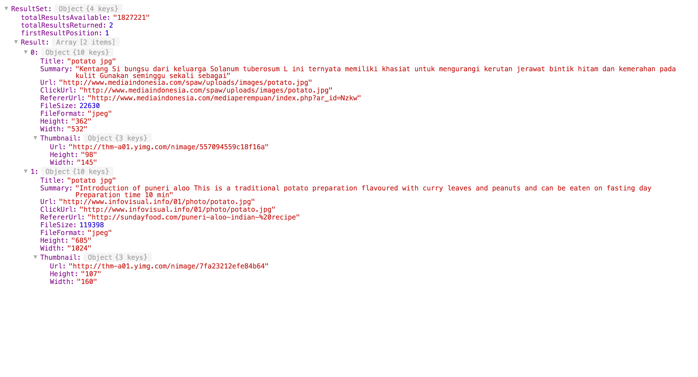
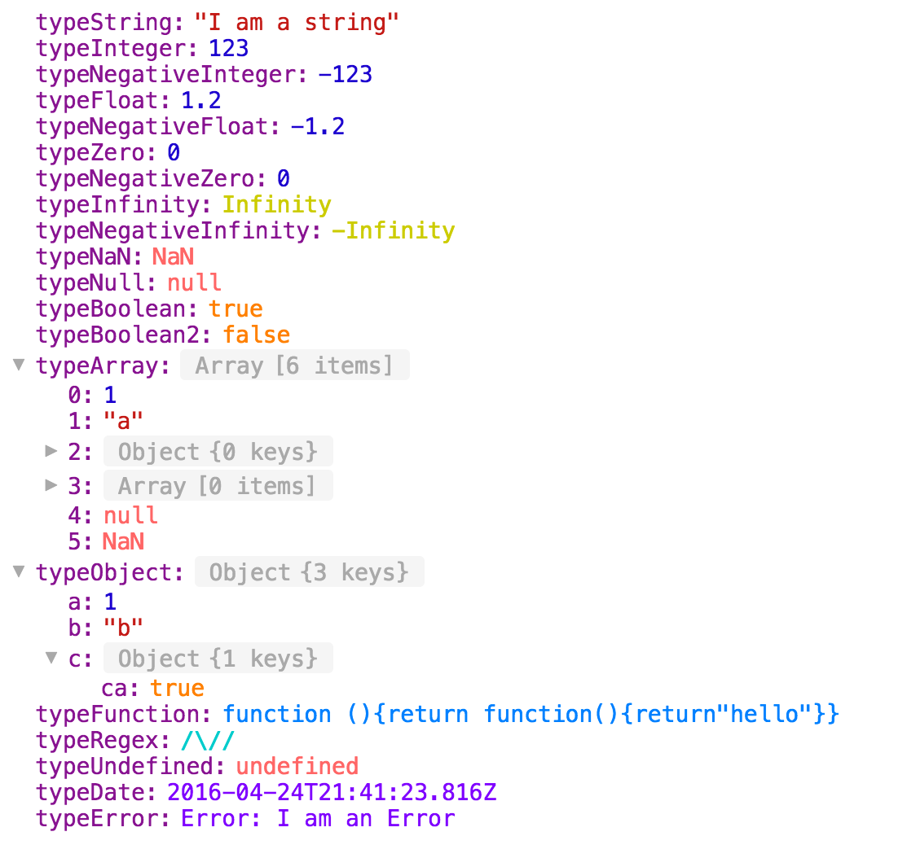

# jshown
A react component to viualize json-like structures. You give it a parsed json or a javascript object, and it renders it with a builtin collapse/expand feature.

## Preview

## Supported data-types

### Tested
- Array
- Object
- String
- Number
- Infinity
- NaN
- Null
- Boolean
- Function
- Regex
- Undefined
- Date
- Error

### Untested yet
- Symbol
- Custom types (i.e. Immutable)

### Lisence
WTFPL
